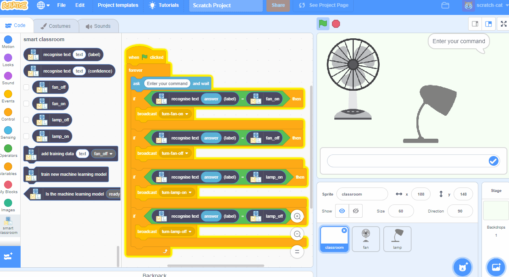

## Introduction

In this project you will use [machinelearningforkids.co.uk](https://machinelearningforkids.co.uk){:target="_blank"} to make a smart virtual classroom assistant that reacts to what you say to it. You’ll be able to control the virtual devices in the classroom by typing in commands!

First, you’ll create an assistant that uses a list of rules for understanding commands, and you'll learn why that approach isn’t very good.

Next, you will teach the assistant to recognise commands for different devices by training it using examples of each command.

### What you will make

--- print-only ---

--- /print-only ---

--- no-print ---

--- /no-print ---

--- collapse ---
---
title: What you will learn
---

+ How to train and test a machine learning model
+ Why this approach is better than using a long list of rules
+ How confidence scores can improve the user experience

--- /collapse ---

--- collapse ---
---
title: What you will need
---

+ A computer connected to the internet

--- /collapse ---

--- collapse ---
---
title: Additional information for educators
---

If you need to print this project, please use the [printer-friendly version](https://projects.raspberrypi.org/en/projects/smart-classroom/print){:target="_blank"}.

--- /collapse ---

### Licence

This project is dual-licensed under both a [Creative Commons Attribution Non-Commercial Share-Alike License](http://creativecommons.org/licenses/by-nc-sa/4.0/){:target="_blank"} and an [Apache License Version 2.0](http://www.apache.org/licenses/LICENSE-2.0){:target="_blank"}.

We'd like to thank Dale from machinelearningforkids.co.uk for all his work on this project.
