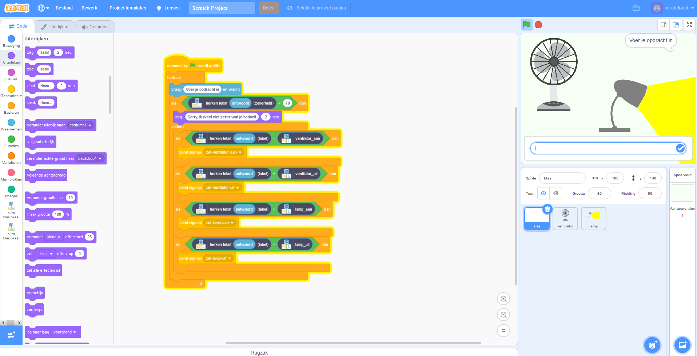
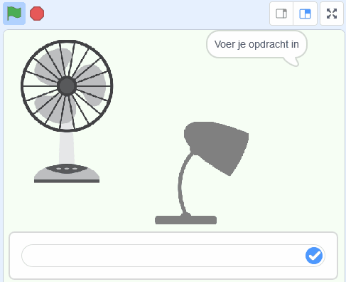

## Inleiding

In dit project gebruik je [machinelearningforkids.co.uk](https://machinelearningforkids.co.uk){:target="_blank"} om een slimme virtuele klassenassistent te maken die reageert op wat je ertegen zegt. Je kunt de virtuele apparaten in de klas besturen door opdrachten in te voeren!

Eerst maak je een assistent die een lijst met regels gebruikt om opdrachten te begrijpen, en leer je waarom die aanpak niet erg goed is.

Vervolgens leer je de assistent om opdrachten voor verschillende apparaten te herkennen door deze te trainen met voorbeelden van elke opdracht.

### Wat ga je maken

\--- print-only \---

\--- /print-only \---

\--- no-print \---

\--- /no-print \---

\--- collapse \---
---
title: Wat ga je leren
---

+ Een machine learning-model trainen en testen
+ Waarom deze aanpak beter is dan het gebruik van een lange lijst met regels
+ Hoe vertrouwensscores de gebruikerservaring kunnen verbeteren

\--- /collapse \---

\--- collapse \---
---
title: Wat heb je nodig
---

+ Een computer verbonden met internet

\--- /collapse \---

\--- collapse \---
---
title: Aanvullende informatie voor docenten
---

Als je dit project wilt afdrukken, gebruik dan de [printervriendelijke versie](https://projects.raspberrypi.org/en/projects/smart-classroom/print) {:target="_blank"}.

\--- /collapse \---

### Licentie

Dit project heeft een dubbele licentie onder zowel een [Creative Commons Attribution Non-Commercial Share-Alike-licentie](http://creativecommons.org/licenses/by-nc-sa/4.0/){:target="_blank"} en een [Apache-licentie versie 2.0](http://www.apache.org/licenses/LICENSE-2.0){:target="_blank"}.

We willen Dale van machinelearningforkids.co.uk graag bedanken voor al zijn werk aan dit project.
