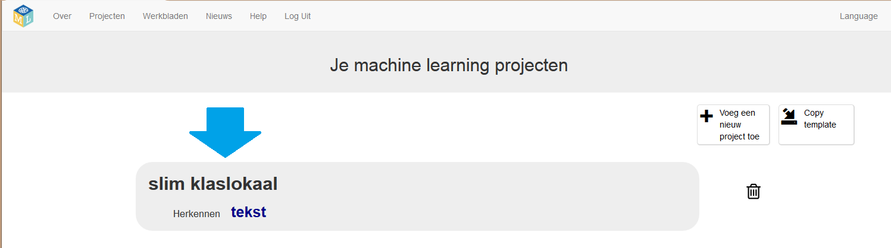
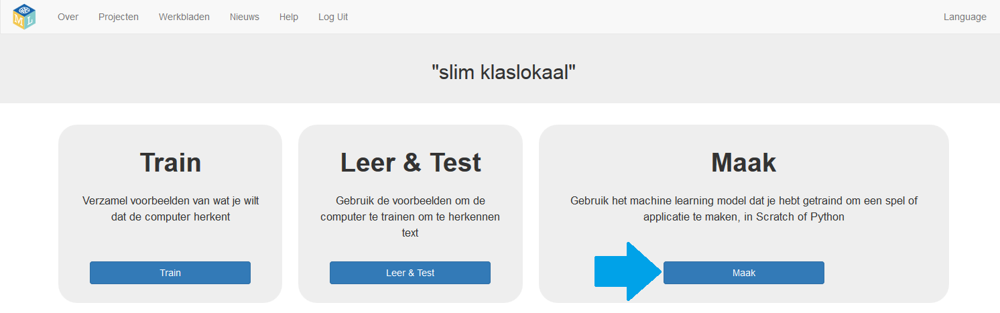
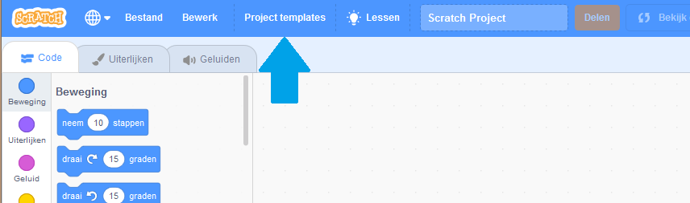
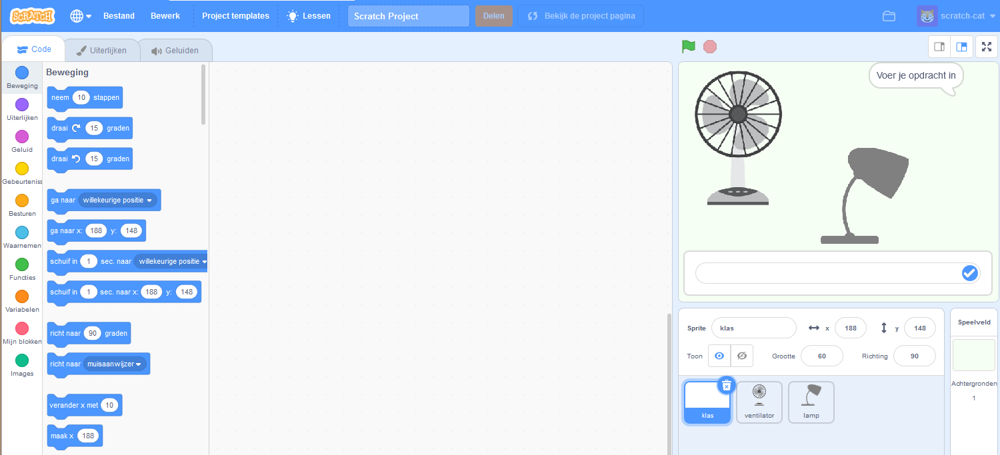

## Hoe een project te maken

\--- task \---
+ Ga naar [machinelearningforkids.co.uk](https://machinelearningforkids.co.uk/){:target="_blank"} in een webbrowser.

+ Klik op **Begin**

+ Klik op **Probeer nu**. \---/task\---

\--- task \---
+ Klik op **Projecten** in de menubalk bovenaan.

+ Klik op de knop **+ Voeg een nieuw project toe**.

+ Noem je project 'slim klaslokaal', stel het in om **tekst** te leren herkennen en stel de taal in op Dutch (Nederlands).  Klik vervolgens op **Creëer**. 

+ Je zou nu 'slim klaslokaal' moeten zien in de projectenlijst. Klik op dit project.  \--- /task \---

\--- task \---

Maak nu een project klaar in Scratch.

+ Klik op **Maak**. 

+ Klik op **Scratch 3**.

+ Klik op **Scratch automatisch opstarten**. De pagina waarschuwt je vervolgens dat je nog geen machine learning hebt uitgevoerd. Klik op **Scratch automatisch opstarten** om Scratch te starten.

+ Klik op **Project templates**. 

+ Klik op het sjabloon **Slim Klaslokaal**.

 \--- /task \---
