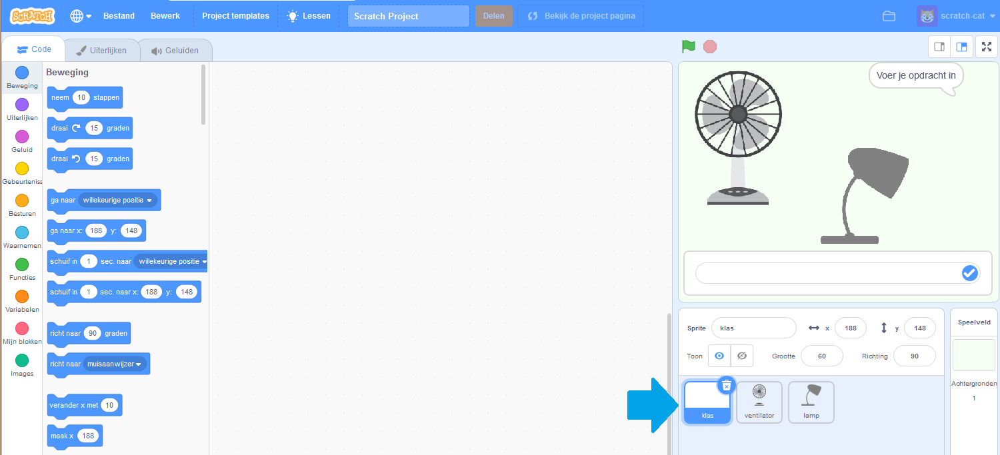
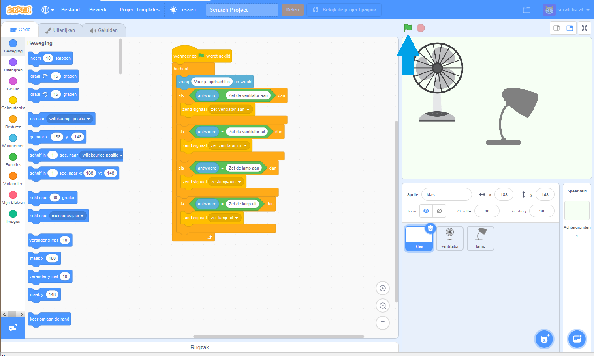

## Voeg een lijst met regels toe

In deze stap bewerk je het project met een lijst met regels voor het aan- en uitzetten van de ventilator en de lamp.

\--- task \---
+ Klik op de sprite van **klas** om deze te selecteren, zoals hieronder weergegeven:



+ Klik op het tabblad **Code** en maak het volgende script:

```blocks3
wanneer groene vlag wordt aangeklikt
herhaal 
vraag [Voer je opdracht in] en wacht
als <(antwoord) = [Zet de ventilator aan]> dan 
zend signaal (zet-ventilator-aan v)
end
als <(antwoord) = [Zet de ventilator uit]> dan 
zend signaal (zet-ventilator-uit v)
end
als <(antwoord) = [Zet de lamp aan]> dan 
zend signaal (zet-lamp-aan v)
end
als <(antwoord) = [Zet de lamp uit]> dan 
zend signaal (zet-lamp-uit v)
end
end
```

+ Klik op **Bestand** en vervolgens op **Opslaan op je computer** en sla het programma op in een bestand. \--- /task \---

\--- task \---

+ Klik op de **groene vlag** om je programma te testen.



+ Typ een opdracht in en kijk hoe het programma reageert! De volgende opdrachten zouden allemaal moeten werken:
    * "Zet de lamp aan"
    * "Zet de lamp uit"
    * "Zet de ventilator aan"
    * "Zet de ventilator uit"

* Typ iets anders en je programma doet niets! Zelfs als je een kleine spelfout maakt, reageert het programma niet.

\--- /task \---

Je vertelt je virtuele klassenassistent om op opdrachten te reageren met een eenvoudige, op regels gebaseerde aanpak. Maar als je wilt dat je programma opdrachten begrijpt die anders zijn geformuleerd, moet je extra `als` blokken toevoegen.

Het probleem met deze op regels gebaseerde benadering is dat je precies alle opdrachten moet voorspellen die de slimme klassenassistent krijgt. Het noteren van elke mogelijk opdracht zou heel, heel lang duren.

Vervolgens probeer je nu een betere aanpak: de computer leren opdrachten zelf te herkennen.