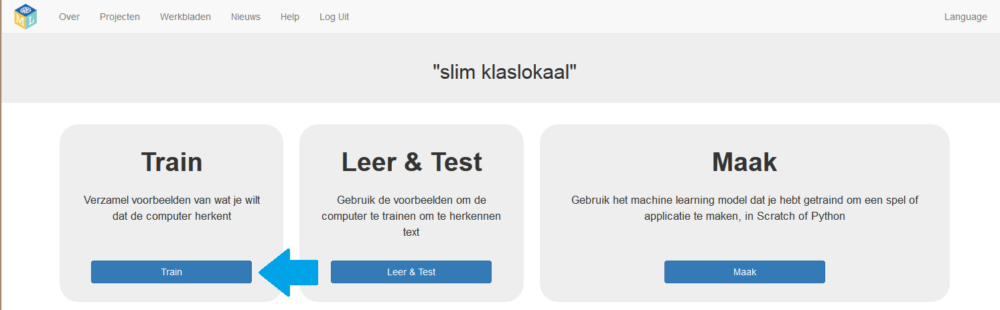
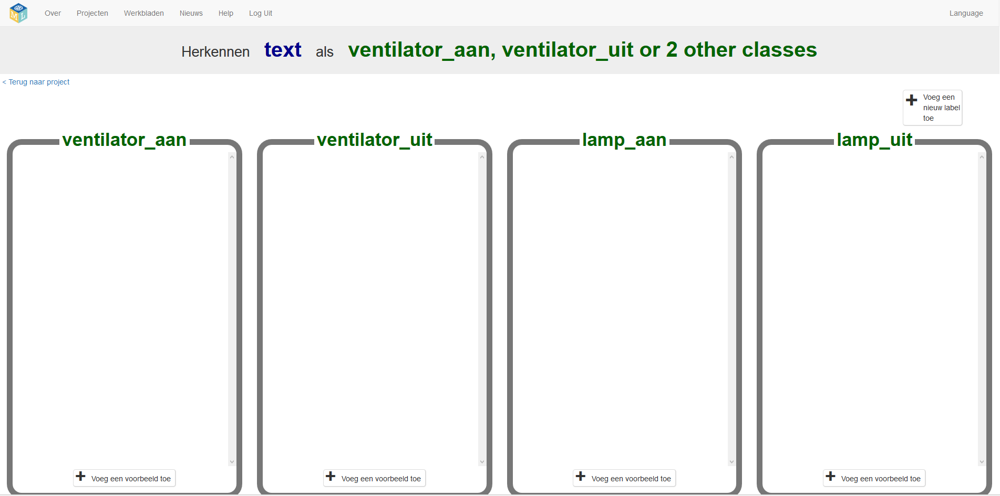
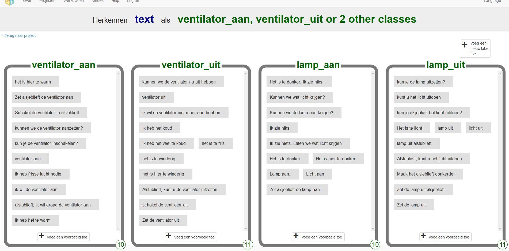

## Verzamel voorbeelden voor training

\--- task \---
+ Sluit het Scratch-venster en ga terug naar de trainingstool.

+ Klik op de link **< Terug naar project**. \---/task\---

\--- task \---
+ Klik op de knop **Train**. 

Je moet enkele voorbeelden verzamelen om de computer te trainen. Om verschillende voorbeelden te verzamelen, moet je 'emmers' maken om de voorbeelden in te plaatsen.

+ Om een emmer te maken, klik op **+ Voeg een nieuw label toe** en noem de emmer “ventilator aan”. Klik weer op **+ Voeg een nieuw label toe** en maak een tweede emmer met de naam "ventilator uit". Maak een derde en een vierde emmer genaamd "lamp aan" en "lamp uit". 

+ Klik op de knop **Voeg een voorbeeld toe** in de emmer 'ventilator aan' en typ een opdracht waarin wordt gevraagd om de ventilator aan te zetten. Je kunt bijvoorbeeld typen "Kun je de ventilator inschakelen".

+ Klik op de knop **Voeg een voorbeeld toe** in de emmer 'ventilator uit' en typ een opdracht waarin wordt gevraagd om de ventilator uit te zetten. Je kunt bijvoorbeeld typen: "Ik wil de ventilator nu uit".

+ Doe hetzelfde voor de emmers "lamp aan" en "lamp uit".

\--- /task \---

\--- task \---
+ Continue to **Add example**s until you have at least **six** examples in **each** bucket.

Be imaginative! Try and think of lots of different ways to ask each command. For example:

+ For “fan on”, you could complain that you’re too hot.
+ For “fan off”, you could complain that it’s too breezy.
+ For “lamp on”, you could complain that you can’t see.
+ For “lamp off”, you could complain that it’s too bright.

\--- collapse \---
---
title: Tips for selecting good examples
---
+ **More is good**: the more examples you give your program, the better the program should get at recognising your commands.

+ **Equal numbers**: add roughly the same number of examples for each command. If you have a lot of examples for one command and not the others, this can affect the way that the program learns to recognise commands.

+ **Make the examples really different from each other**: try to come up with lots of different types of examples. For example, make sure that you include some long examples and some very short ones.

\--- /collapse \--- \--- /task \---

In the next step you will train your program to recognise any new command automatically by comparing it to the examples in the four buckets.
