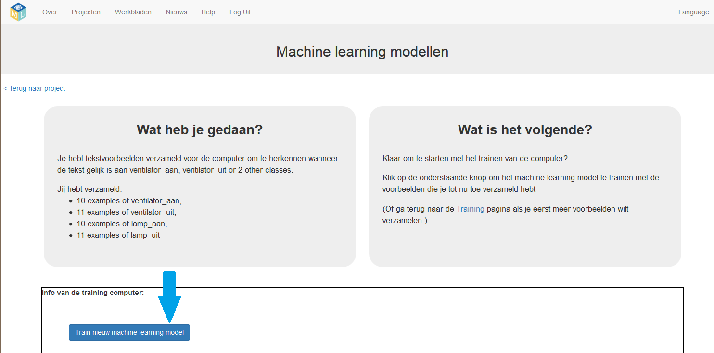
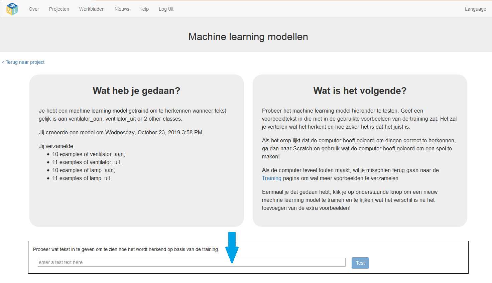

## Train en test een machine learning-model

Je traint nu het programma met behulp van de voorbeelden en test het vervolgens.

Het programma leert van patronen in de voorbeelden die je geeft, zoals de woordkeuze en de manier waarop zinnen zijn gestructureerd. Vervolgens kan het, op basis van de patronen die het programma vindt, nieuwe opdrachten interpreteren.

\--- task \---
+ Klik op de link **< Terug naar project** en klik vervolgens op **Leer & Test**.

+ Klik op de knop **Train nieuwe machine learning model**. Als je genoeg voorbeelden hebt, zou het programma moeten beginnen te leren hoe opdrachten uit deze voorbeelden te herkennen.

 \---/task\---

Wacht tot de training is voltooid. Dit kan een minuut of twee duren. Terwijl je wacht, voltooi je de machine-learning meerkeuzevragen onderaan de pagina.

\--- task \--- Nadat de training is voltooid, verschijnt een testvak. Test je machine learning-model om te zien wat het heeft geleerd.

+ Typ een van de opdrachten die je aan een container hebt toegevoegd en druk vervolgens op <kbd>Test</kbd>. De opdracht zou herkend moeten worden.

+ Typ **opdrachten die zich niet in de emmers bevinden**.

Als je niet tevreden bent met hoe de computer de opdrachten herkent, ga je terug naar de vorige stap en voeg je nog enkele voorbeelden toe. Dan **train nieuw machine learning model** opnieuw.

 \--- /task \---

In plaats van regels voor het programma te schrijven, geef je de programmavoorbeelden. Het programma gebruikt de voorbeelden om een machine learning-**model** te trainen.

Omdat je de training van het programma begeleidt door voorbeelden te geven, wordt deze machine learning-aanpak **supervised learning** (leren onder toezicht) genoemd.