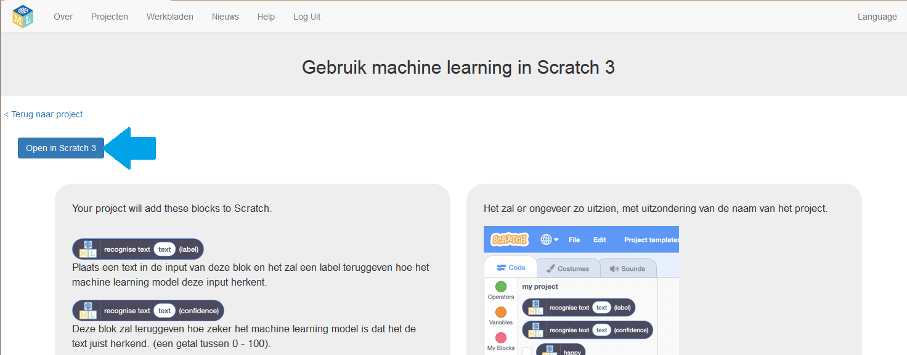
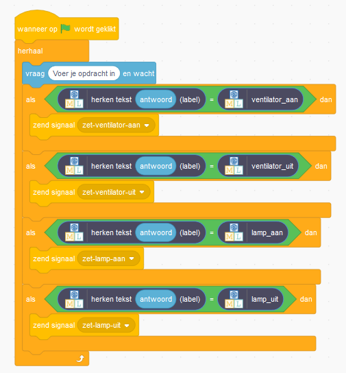

## Gebruik het machine learning-model in Scratch

Werk nu je Scratch-programma bij met je machine learning-model in plaats van een op regels gebaseerde aanpak.

\--- task \---
+ Klik op de link **<Terug naar project**.

+ Klik op **Maak**.

+ Klik op **Scratch 3**.

+ Lees de instructies op de pagina voor meer informatie over het gebruik van machine learning-blokken in Scratch.

+ Klik op **Openen in Scratch 3**.

+ Klik op **Bestand** en vervolgens op **Uploaden vanaf je computer**en selecteer het eerder opgeslagen Scratch-project.

+ Wanneer Scratch je vraagt of het huidige project moet worden vervangen, klik je op **OK**.

\---/task\---

\--- task \---

+ Klik op het tabblad **Code** en werk je Scratch-code bij om je machine learning-model te gebruiken **in plaats** van de regels die je eerst hebt toegevoegd.

Het blok `herkennen tekst … (label)` is een nieuw blok dat door je project is toegevoegd. Dit nieuwe blok kan een bericht ontvangen en een van de vier labels retourneren, op basis van het door jouw getrainde machine-leermodel.

 \---/task\---

\--- task \---
+ Klik op de **groene vlag** om opnieuw te testen.

+ Test je project: typ een opdracht en druk op <kbd>Enter</kbd> op je toetsenbord. De ventilator of lamp moet op je commando reageren.

Zorg ervoor dat je test of dit werkt, **zelfs voor opdrachten die je niet als voorbeelden in de containers hebt opgenomen.**

+ Sla je project op: klik op **Bestand** en vervolgens op **Opslaan op je computer**. \---/task\---

Nu gebruikt je slimme virtuele klaslokaal in Scratch een machine learning-model in plaats van een op regels gebaseerde aanpak.

Machine learning gebruiken is beter dan regels gebruiken, omdat het trainen van een programma om opdrachten voor zichzelf te herkennen veel sneller is dan proberen een lijst te maken van alle mogelijke opdrachten.

Hoe meer voorbeelden je gebruikt om het machine learning-model te trainen, hoe beter je programma zou moeten worden in het herkennen van opdrachten.