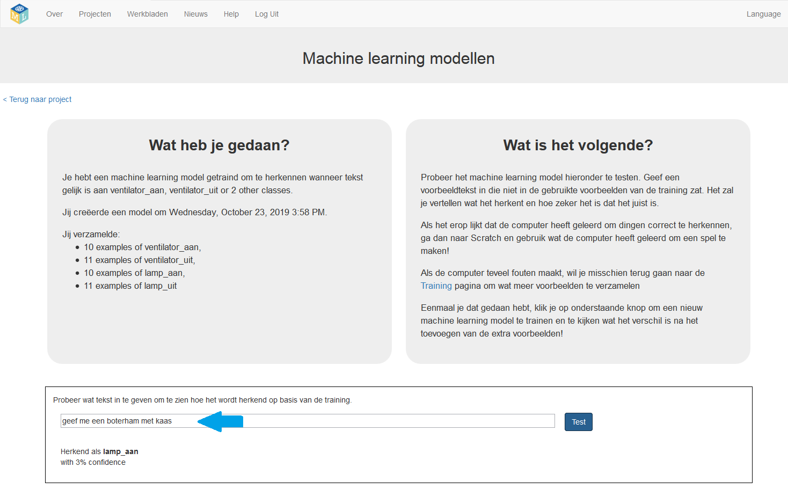
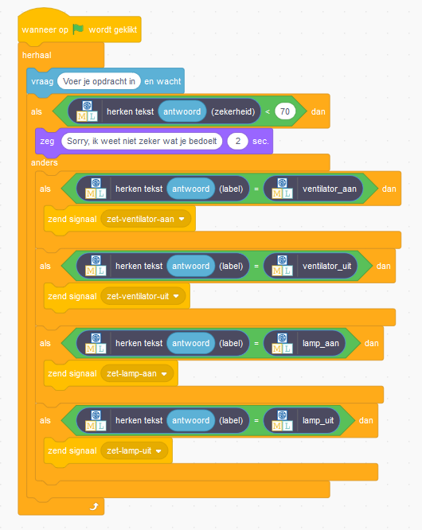

## Hoe betrouwbaarheidsscores te gebruiken

Ten slotte leer je wat betrouwbaarheidsscores betekenen en hoe je ze moet gebruiken.

\--- task \---
+ Laat Scratch open, want je komt zo terug.

+ Ga terug naar de pagina **Leer & Test** in de trainingstool.

+ Typ iets dat niets te maken heeft met lampen of ventilatoren in de testbox. Je kunt bijvoorbeeld typen 'geef me een boterham met kaas'. 

+ Kijk naar de betrouwbaarheidsscore, die erg laag zou moeten zijn.

+ Vergelijk dit met de betrouwbaarheidsscore die je krijgt voor een commando zoals "doe de lamp aan".

**De betrouwbaarheidsscore is de manier van het programma om je te vertellen hoe zeker het is dat het een opdracht begrijpt.** Als een opdracht erg lijkt op de voorbeelden waarmee je het programma hebt getraind, is de betrouwbaarheidsscore hoog. Als een opdracht **niet** vergelijkbaar is, is de betrouwbaarheidsscore laag.

\--- /task \---

\--- task \---

+ Ga terug naar je klassenassistent-project in Scratch.

+ Wijzig het script voor de 'klas' sprite zodat deze de betrouwbaarheidsscore gebruikt:

+ Klik op de groene vlag en test je programma om te controleren of jouw klassenassistent op de juiste manier reageert:
    + Typ opdrachten in die niets met de ventilator of lamp te maken hebben
    + Vraag om iets aan of uit te zetten

Als je programma niet zeker weet wat je bedoelt, zegt het je dat. Dan kun je proberen het een andere opdracht te geven. \--- /task \---

Je hebt machine learning gebruikt om een slimme assistent te trainen, een eenvoudige versie van de assistenten die je op smartphones kunt krijgen (bijvoorbeeld Apple's Siri of Google's Assistent) of thuis (bijvoorbeeld Amazon's Alexa of Google's Home).

Het programma trainen om opdrachten te herkennen is veel eenvoudiger dan proberen een lijst te maken van alle mogelijke opdrachten. En hoe meer voorbeelden je het programma geeft, hoe beter het wordt in het herkennen van opdrachten en hoe meer de betrouwbaarheidsscores toenemen. 